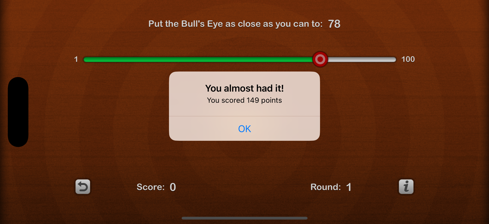
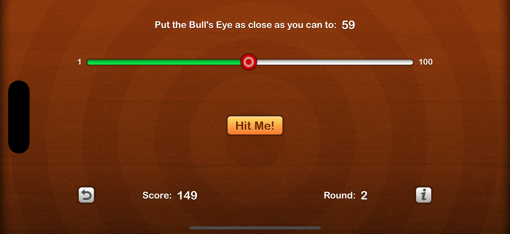
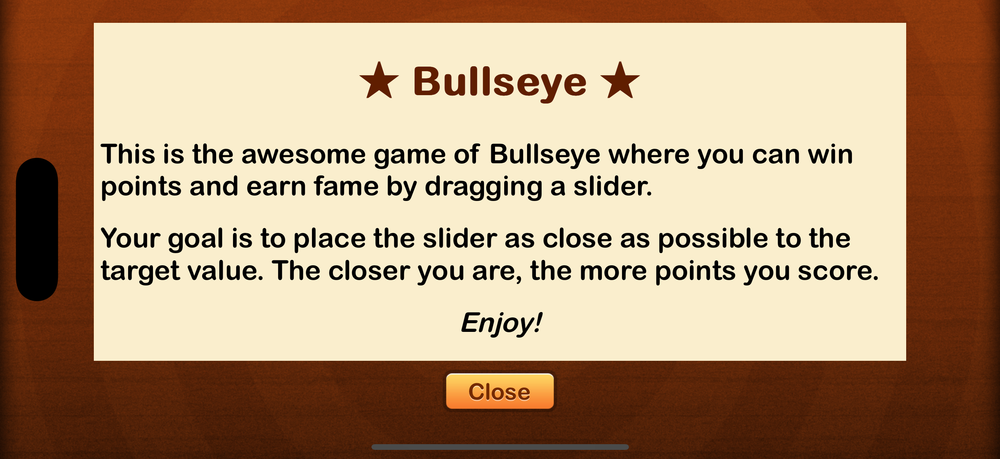

# Bull's Eye
A simple game to place the slider as close to the randomly chosen target value as you can.

Your goal is to place the slider as close as possible to the target value. The closer you are, the more points you score.
Enjoy!

## UIKit Views & Controllers

The following views are used in creating the UI of the app:
- UIStackView
- UISlider
- UILabel
- UIButton
- UIAlertController
- WKWebView

## UIKit Concepts
The following concepts and techniques are used:
- Outlets (**@IBOutlet**)
- Actions (**@IBAction**)
- Auto Layout Constraints
- Safe Area Layout Guides

## Swift & Miscellaneous 
The following extra concepts are used to make the app logic work:
- Properties (**var**)
- Methods (**func**)
- Property Getters and Setters (**get**, **set**)
- Property Observers (**willSet**, **didSet**)
- Conditional Statements (**if-else**)
- Random Number Generation (**Int.random(in:)**)
- Implicitly unwrapped optionals
- Loading web content from a bundled .html file
- Customizing the appearance of views in Interface Builder and Swift code
- Image Assets (**Assets.xcassets**)

Above views and concepts are the entirety of this simple app.

# Screenshots

