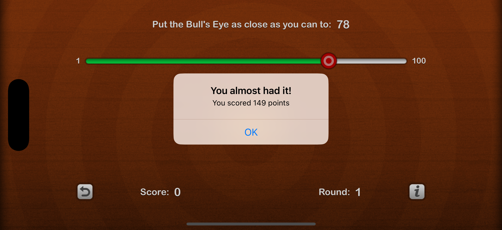

# Checklists
A simple app that lets you organize to-do items into lists and then check off these items once you've completed them. You can also set a reminder on a to-do item that will make the iPhone pop up an alert on the due date, even when the app isn't running.

## UIKit Views & Controllers

The following views are used in creating the UI of the app:
- UITableView
- UINavigationController
- UIStackView
- UITextField
- UILabel
- UIButton

## UIKit Concepts
The following concepts and techniques are used:
- Outlets (**@IBOutlet**)
- Actions (**@IBAction**)
- Auto Layout Constraints
- Safe Area Layout Guides

## Swift & Miscellaneous 
The following extra concepts are used to make the app logic work:
- Properties (**var**)
- Methods (**func**)
- Property Getters and Setters (**get**, **set**)
- Property Observers (**willSet**, **didSet**)
- Conditional Statements (**if-else**)
- Implicitly unwrapped optionals
- Customizing the appearance of views in Interface Builder and Swift code
- Image Assets (**Assets.xcassets**)

Above views and concepts are the entirety of this simple app.

# Screenshots
<!---->
