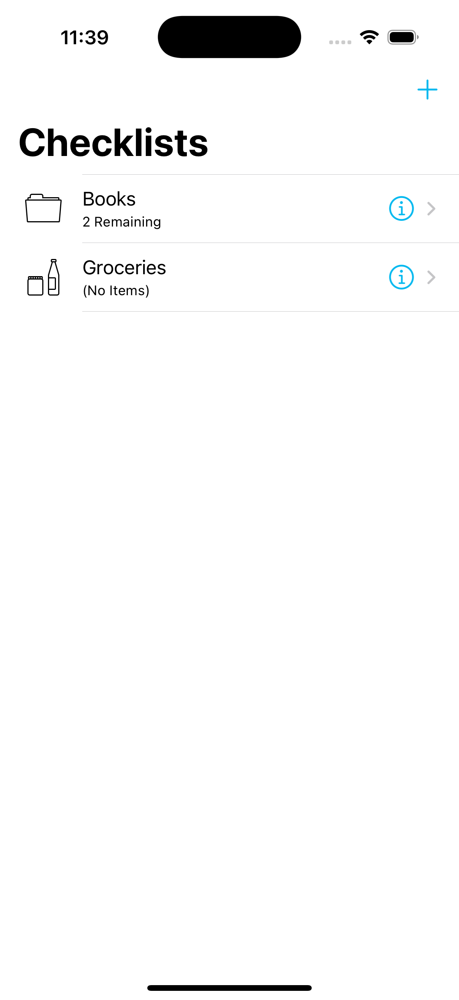

# My Locations
Keep a diary of your favorite locations. Add photos and notes to them for great memories.

## UIKit Views & Controllers

The following views are used in creating the UI of the app:
- UITableView
- UINavigationController
- UITabBarController
- UINavigationBar
- UIStackView
- UITextField
- UILabel
- UIButton
- UIBarButtonItem
- UISwitch
- UIDatePicker
- UIStoryboardSegue

## UIKit Concepts
The following concepts and techniques are used:
- Outlets (**@IBOutlet**)
- Actions (**@IBAction**)
- Auto Layout Constraints
- Safe Area Layout Guides

## Swift & Miscellaneous 
The following extra concepts are used to make the app logic work:
- Properties (**var**)
- Methods (**func**)
- Property Getters and Setters (**get**, **set**)
- Property Observers (**willSet**, **didSet**)
- Conditional Statements (**if-else**)
- Protocols (**protocol**)
- Implicitly unwrapped optionals
- Customizing the appearance of views in Interface Builder and Swift code
- Image Assets (**Assets.xcassets**)

Above views and concepts are the entirety of this simple app.

<!--# Screenshots-->
<!--    -->
